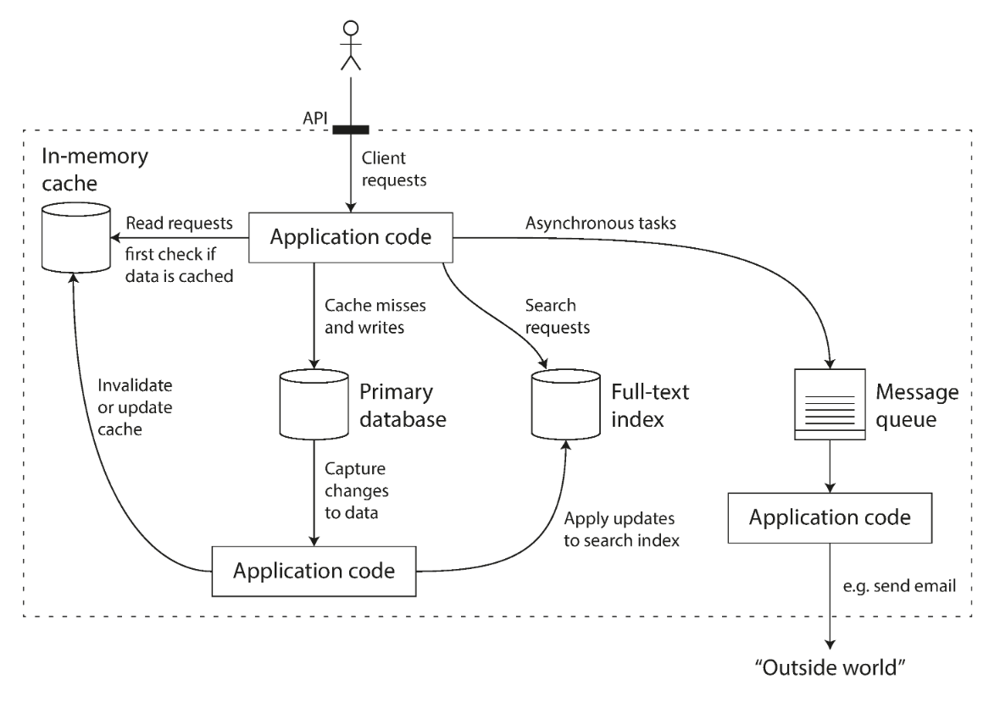

# Chapter 1
Reliable, Scalable, and Maintainable Applications

## Definition of Data Intensive

The amount of data, complexity of data, and the speed at which it is changing. 

## Data Intensive applications common functionalities and abstractions

1. **Database**: store data so that they or another program may access it later
2. **Cache**: Remember the result of an expensive operation to speed up reads
3. **Search Index**: Allow users to search data by keywords or filter it in various ways
4. **Batch Processing**: Periodically crunch a large amount of accumulated data

## Questions to Ask
1. Which data system or data systems should I use or combine for my task at hand?
2. What is each tool's characteristics, what distinguishes them, and how they achieve their characteristics?

## An Example of Data System

When you combine several tools in order to provide a service, the service’s interface or  application  programming  interface  (API)  usually  hides  those  implementation details  from  clients.  Now  you  have  essentially  created  a  new,  special-purpose  data system from smaller, general-purpose components. Your composite data system may provide  certain  guarantees:  e.g.,  that  the  cache  will  be  correctly  invalidated  or  updated  on  writes  so  that  outside  clients  see  consistent  results.  You  are  now  not  only  an
application developer, but also a data system designer.

## Reliability, Scalability and Maintainability

1. Reliability: The system should continue to work correctly (performing the correct function at the desired level of performance) even in the face of adversity (hardware or software faults, and even human error. )

2. Scalability: As the system grows (in data volumn, traffic volumn, or complexity), there should be reasonable ways to dealing with that growth. 

3. Maintainability: Over time, many different people will work on the system (engineering and operations, both maintaining current behavior and adapting the system to new use cases), and they should be able to work on it productively. 